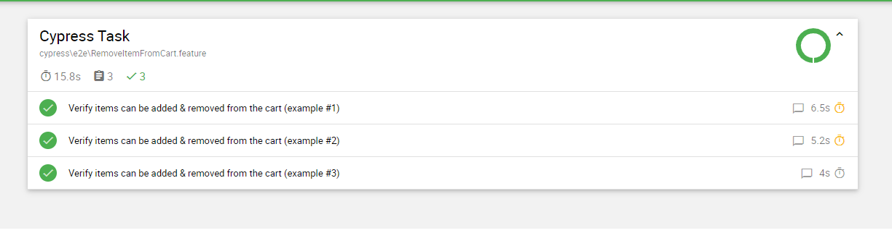

# Cypress Tech Test - Michael Robson

The scenario requested is complete and currently passing, if you have any questions, please add a comment or send an email to ajrobson1985@gmail.com

I've included linting and prettier to ensure the code meets the cypress recommended ruleset and is formatted to the same standard throughout.

I've included husky and a pre-commit hook to ensure these checks happen before a commit to a branch occurs.

# Instructions

Before running the tests, you need to do the following:

- Run `yarn install` to pull the dependencies
- Set the base URL through the terminal:
  - **Windows**: `set CYPRESS_BASE_URL=_The test applications URL you provided_`
  - **Mac / Linux** `export CYPRESS_BASE_URL=_The test applications URL you provided_`

## Ways to run the tests

Multiple scripts have been added to the `package.json` file to run the test suite in different browsers in both headed and headless modes:

| **Browser**                      | **Command**              | **Gui**  |
| -------------------------------- | ------------------------ | -------- |
| Chrome                           | `yarn chrome:headless`   | Headless |
| Chrome                           | `yarn chrome:headed`     | Headed   |
| Edge                             | `yarn edge:headless`     | Headless |
| Edge                             | `yarn edge:headed`       | Headed   |
| Electron (packaged with Cypress) | `yarn electron:headless` | Headless |
| Electron (Packaged with Cypress) | `yarn electron:headed`   | Headed   |
| Firefox                          | `yarn firefox:headless`  | Headless |
| Firefox                          | `yarn firefox:headed`    | Headed   |

If none of these commands suit your needs then you can open the Cypress IDE and pick a browser on your system with `yarn cypress:open`

# Proof of test run

